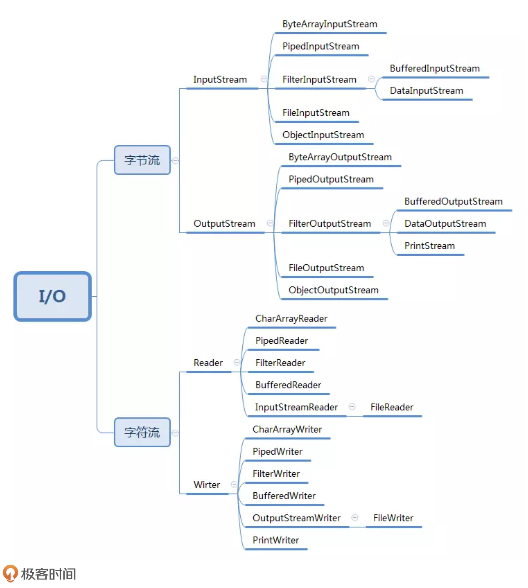

装饰器模式主要解决继承关系过于复杂的问题，通过组合来替代继承。它主要的作用是给原始类添加增强功能。通过使用装饰器，我们可以在运行时动态地扩展对象的功能，而不是通过继承创建大量的子类。

## 案例 java io



## 主要特点

1. 装饰器类和原始类继承同样的父类，这样我们可以对原始类“嵌套”多个装饰器类
2. 装饰器类是对功能的增强，这也是装饰器模式应用场景的一个重要特点。就拿比较相似的代理模式和装饰器模式来说吧，代理模式中，代理类附加的是跟原始类无关的功能，而在装饰器模式中，装饰器类附加的是跟原始类相关的增强功能。

```java

// 代理模式的代码结构(下面的接口也可以替换成抽象类)
public interface IA {
  void f();
}
public class A impelements IA {
  public void f() { //... }
}
public class AProxy implements IA {
  private IA a;
  public AProxy(IA a) {
    this.a = a;
  }
  
  public void f() {
    // 新添加的代理逻辑
    a.f();
    // 新添加的代理逻辑
  }
}

// 装饰器模式的代码结构(下面的接口也可以替换成抽象类)
public interface IA {
  void f();
}
public class A implements IA {
  public void f() { //... }
}
public class ADecorator implements IA {
  private IA a;
  public ADecorator(IA a) {
    this.a = a;
  }
  
  public void f() {
    // 功能增强代码
    a.f();
    // 功能增强代码
  }
}
```

## 参考链接

https://stackoverflow.com/questions/18618779/differences-between-proxy-and-decorator-pattern

