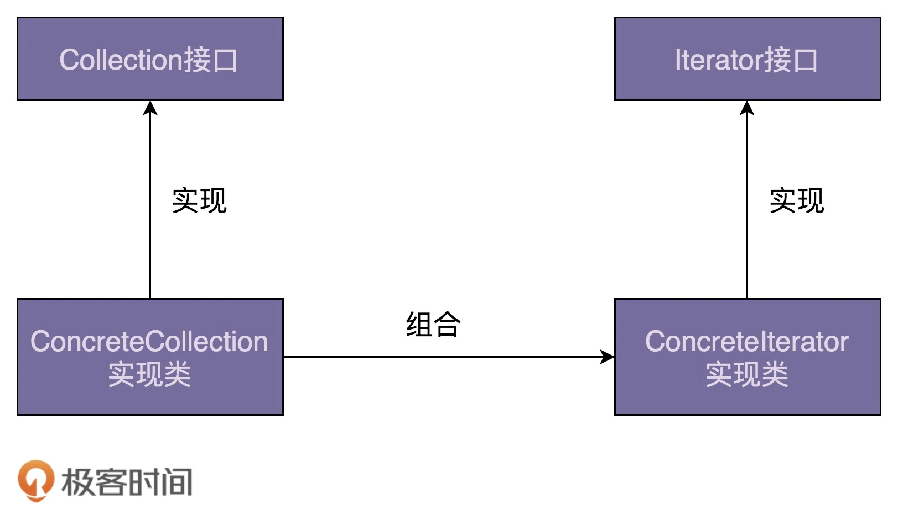
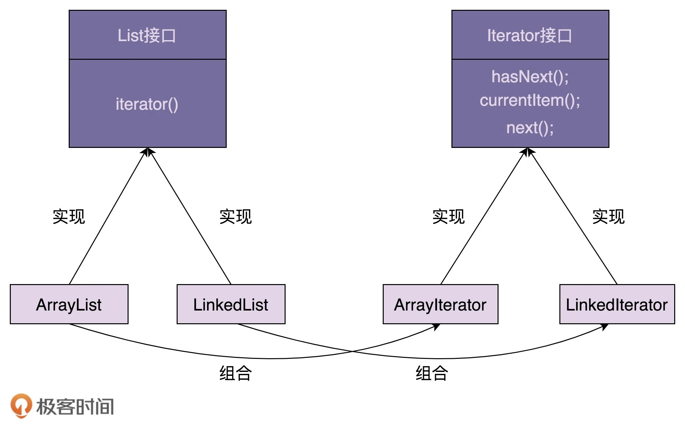

迭代器是用来遍历容器的，所以，一个完整的迭代器模式一般会涉及容器和容器迭代器两部分内容。

## question

在 Java 中，如果在使用迭代器的同时删除容器中的元素，会导致迭代器报错

容器维护了一个 modCount 的变量，意思是结构修改的次数，当每次容器修改数据时（增加、删除等），modCount 就会改变。 

在创建迭代器时，会将 modCount 赋值给迭代器内部维护的 expectedModCount 变量，

并在每次调用迭代器的方法时，判断这两个值是否相等，如果不相等则抛出 ConcurrentModificationException 异常。 

进行这个判断，就是不让外界在使用迭代器时去修改数据结构，因为这会导致不可预期的问题，例如漏遍历了，越界了等问题。

这是一个 fast-fail 机制，当发现问题时，马上将问题显现出来。 

解决该问题： 
1. 最简单的方法就是不要在迭代时去修改数据结构。 
2. 或者直接用迭代器的 remove() 方法，使用迭代器的 remove() 方法有些限制，就是只能删除前一个已经遍历过的元素（内部会重新对 expectedModCount 进行赋值，所以不会出现异常）。 
3. 使用支持并发的数据容器。

在 Java 实现中，迭代器类是容器类的内部类
