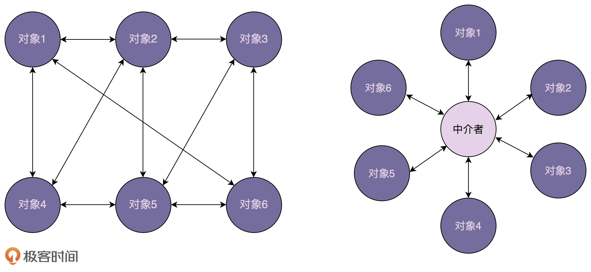

中介模式的英文翻译是 Mediator Design Pattern。

在 GoF 中的《设计模式》一书中，它是这样定义的：

Mediator pattern defines a separate (mediator) object that encapsulates the interaction between a set of objects and the objects delegate their interaction to a mediator object instead of interacting with each other directly.

翻译成中文就是：中介模式定义了一个单独的（中介）对象，来封装一组对象之间的交互。将这组对象之间的交互委派给与中介对象交互，来避免对象之间的直接交互。

通过引入中介这个中间层，将一组对象之间的交互关系（或者说依赖关系）从多对多（网状关系）转换为一对多（星状关系）。

提到中介模式，有一个比较经典的例子不得不说，那就是航空管制。为了让飞机在飞行的时候互不干扰，每架飞机都需要知道其他飞机每时每刻的位置，这就需要时刻跟其他飞机通信。飞机通信形成的通信网络就会无比复杂。这个时候，我们通过引入“塔台”这样一个中介，让每架飞机只跟塔台来通信，发送自己的位置给塔台，由塔台来负责每架飞机的航线调度。这样就大大简化了通信网络。

原本业务逻辑会分散在各个控件中，现在都集中到了中介类中。实际上，这样做既有好处，也有坏处。好处是简化了控件之间的交互，坏处是中介类有可能会变成大而复杂的“上帝类”（God Class）。所以，在使用中介模式的时候，我们要根据实际的情况，平衡对象之间交互的复杂度和中介类本身的复杂度。
