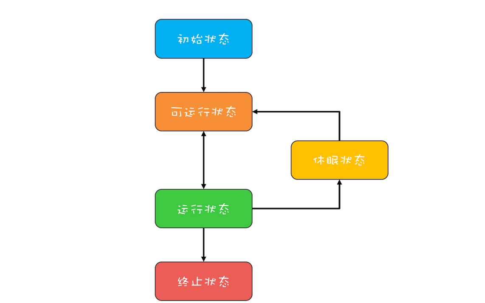

1. 初始状态，指的是线程已经被创建，但是还不允许分配 CPU 执行。这个状态属于编程语言特有的，不过这里所谓的被创建，仅仅是在编程语言层面被创建，而在操作系统层面，真正的线程还没有创建。
2. 可运行状态，指的是线程可以分配 CPU 执行。在这种状态下，真正的操作系统线程已经被成功创建了，所以可以分配 CPU 执行。
3. 当有空闲的 CPU 时，操作系统会将其分配给一个处于可运行状态的线程，被分配到 CPU 的线程的状态就转换成了运行状态。
4. 运行状态的线程如果调用一个阻塞的 API（例如以阻塞方式读文件）或者等待某个事件（例如条件变量），那么线程的状态就会转换到休眠状态，同时释放 CPU 使用权，休眠状态的线程永远没有机会获得 CPU 使用权。
5. 当等待的事件出现了，线程就会从休眠状态转换到可运行状态。线程执行完或者出现异常就会进入终止状态，终止状态的线程不会切换到其他任何状态，进入终止状态也就意味着线程的生命周期结束了。

这五种状态在不同编程语言里会有简化合并。例如，C 语言的 POSIX Threads 规范，就把初始状态和可运行状态合并了；Java 语言里则把可运行状态和运行状态合并了，这两个状态在操作系统调度层面有用，而 JVM 层面不关心这两个状态，因为 JVM 把线程调度交给操作系统处理了。

Java 语言中线程共有六种状态，分别是：
1. NEW（初始化状态）RUNNABLE（可运行 / 运行状态）
2. BLOCKED（阻塞状态）
3. WAITING（无时限等待）
4. TIMED_WAITING（有时限等待）
5. TERMINATED（终止状态）

这看上去挺复杂的，状态类型也比较多。 但其实在操作系统层面，Java 线程中的 BLOCKED、WAITING、TIMED_WAITING 是一种状态，即前面我们提到的休眠状态。也就是说只要 Java 线程处于这三种状态之一，那么这个线程就永远没有 CPU 的使用权。

原因是这段代码在执行的时候，大部分时间都是阻塞在 sleep(100) 上，当其他线程通过调用th.interrupt().来中断 th 线程时，大概率地会触发 InterruptedException 异常，在触发 InterruptedException 异常的同时，JVM 会同时把线程的中断标志位清除，所以这个时候th.isInterrupted()返回的是 false。正确的处理方式应该是捕获异常之后重新设置中断标志位

