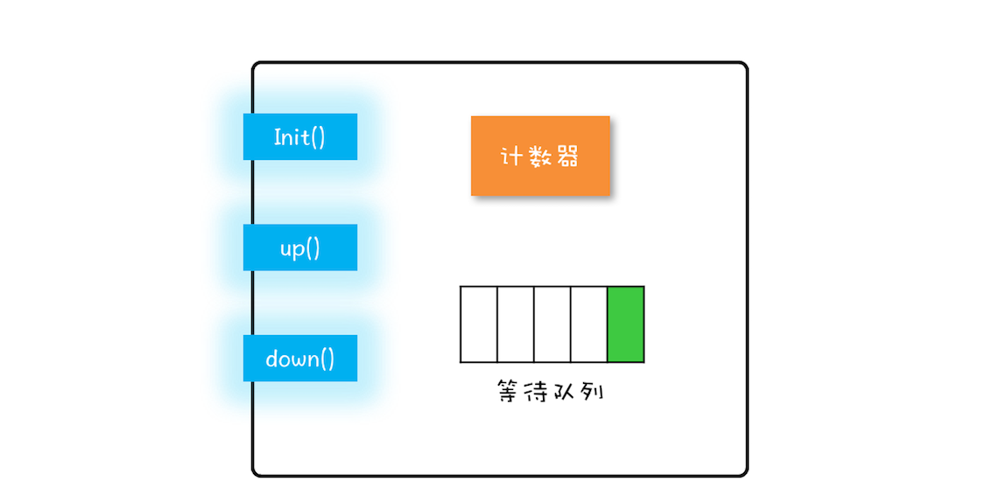

信号量模型还是很简单的，可以简单概括为：一个计数器，一个等待队列，三个方法。在信号量模型里，计数器和等待队列对外是透明的，

这三个方法详细的语义具体如下所示。
1. init()：设置计数器的初始值。
2. down()：计数器的值减 1；如果此时计数器的值小于 0，则当前线程将被阻塞，否则当前线程可以继续执行。
3. up()：计数器的值加 1；如果此时计数器的值小于或者等于 0，则唤醒等待队列中的一个线程，并将其从等待队列中移除。

这里提到的 init()、down() 和 up() 三个方法都是原子性的，并且这个原子性是由信号量模型的实现方保证的。
在 Java SDK 里面，信号量模型是由 java.util.concurrent.Semaphore 实现的，Semaphore 这个类能够保证这三个方法都是原子操作。

信号量模型里面，down()、up() 这两个操作历史上最早称为 P 操作和 V 操作，所以信号量模型也被称为 PV 原语

那就是：Semaphore 可以允许多个线程访问一个临界区。
