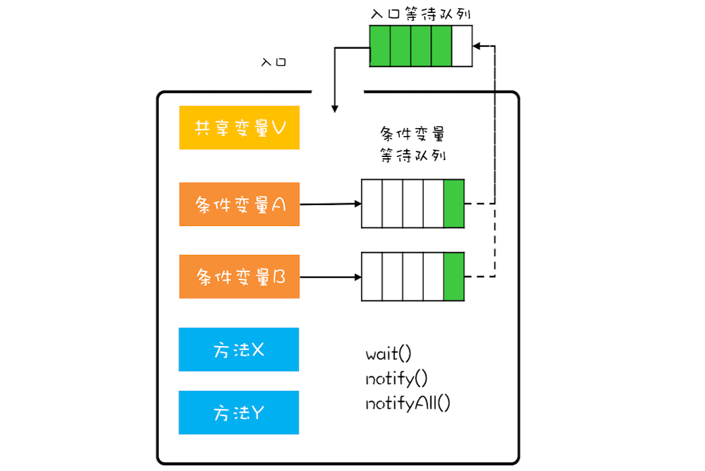

Java 采用的是管程技术，synchronized 关键字及 wait()、notify()、notifyAll() 这三个方法都是管程的组成部分。

在管程的发展史上，先后出现过三种不同的管程模型，分别是：Hasen 模型、Hoare 模型和 MESA 模型。其中，现在广泛应用的是 MESA 模型，并且 Java 管程的实现参考的也是 MESA 模型

在管程模型里，共享变量和对共享变量的操作是被封装起来的，图中最外层的框就代表封装的意思。框的上面只有一个入口，并且在入口旁边还有一个入口等待队列。当多个线程同时试图进入管程内部时，只允许一个线程进入，其他线程则在入口等待队列中等待

管程里还引入了条件变量的概念，而且每个条件变量都对应有一个等待队列，如下图，条件变量 A 和条件变量 B 分别都有自己的等待队列。

